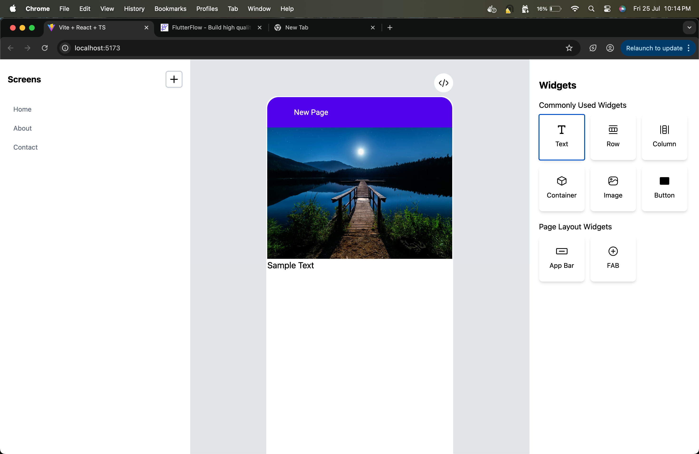

# 🧩 STAC JSON Generator

A lightweight, extensible **visual JSON generator** for building **STAC (Server-Driven UI)** schemas. Built with a modern **React + Tailwind CSS** drag-and-drop interface.

> Inspired by tools like FlutterFlow and Retool, but focused entirely on generating portable STAC JSON for Flutter-based server-driven UIs.

---

## ✨ Features

- 🎨 **Drag-and-drop UI** builder with live preview
- ⚡ Generates **STAC-compliant JSON** for server-driven Flutter apps
- 📦 Widget palette with commonly used components (Text, Image, Button, etc.)
- 📱 Mobile-first canvas preview to simulate Flutter screens
- 🧪 JSON output ready to be used inside your own Flutter project

---

## 📸 Preview



_Initial version featuring screen navigation, preview, and a basic widget set._

---

## 🚀 Getting Started

### Prerequisites

- [Node.js](https://nodejs.org/)
- npm or yarn

### Clone the Repo

```bash
git clone https://github.com/murali-cse/stac-json-generator.git
cd stac-json-generator
npm install
npm run dev
```

Visit http://localhost:5173 to access the visual builder.

---

## 📤 Export & Use

### Once you've designed your UI:

- Click the </> Export icon to download the STAC JSON.

- Use this JSON inside your Flutter project that supports server-driven UI using STAC.

Note: This tool does not render the UI itself. It only generates JSON compatible with your own Flutter STAC runtime.

---

## 📅 Roadmap

- [] Drag to reorder widgets
- [] Save/load projects from local storage or backend
- [] Multi-screen flows
- [] Widget properties editor
- [] STAC JSON schema validation

## 🛡 License

This project is open-source under the MIT License.

---

## 🤝 Contributing

Contributions are welcome!

1. Fork the repo

2. Create your branch (git checkout -b feature/my-feature)

3. Commit your changes (git commit -m 'Add some feature')

4. Push to GitHub (git push origin feature/my-feature)

5. Create a Pull Request

---

## 🙌 Acknowledgements

- Inspired by FlutterFlow and other visual editors

- Built with ❤️ using Vite, React, and TailwindCSS

## 📬 Contact

Created by @murali-cse. For questions or ideas, open an issue or get in touch!
